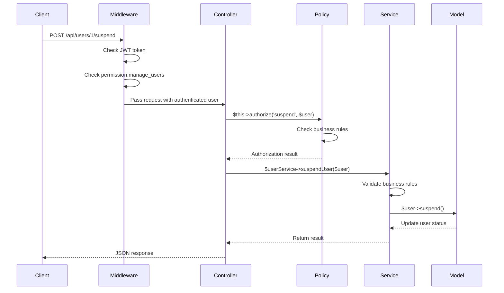

# Authorization Pattern for Laravel API + JWT + RBAC

## Authorization Layers

```
┌─────────────────────────────────────────────────────────────┐
│                    ROUTE LAYER                              │
│  ┌─────────────────┐  ┌─────────────────┐  ┌─────────────────┐│
│  │   Public Route  │  │  Protected Route│  │ Admin Route     ││
│  │   (No Auth)     │  │   (JWT Auth)    │  │ (Specific Perm) ││
│  └─────────────────┘  └─────────────────┘  └─────────────────┘│
└─────────────────────────────────────────────────────────────┘
                                │
                                ▼
┌─────────────────────────────────────────────────────────────┐
│                 MIDDLEWARE LAYER                           │
│  ┌─────────────────┐  ┌─────────────────┐  ┌─────────────────┐│
│  │JwtAuthenticate  │  │CheckPermission  │  │RoleMiddleware   ││
│  │(Token Validation│  │(permission:xxx)│  │(Optional)       ││
│  │ & User Inject)  │  │                 │  │                 ││
│  └─────────────────┘  └─────────────────┘  └─────────────────┘│
└─────────────────────────────────────────────────────────────┘
                                │
                                ▼
┌─────────────────────────────────────────────────────────────┐
│                 CONTROLLER LAYER                           │
│  ┌─────────────────┐  ┌─────────────────┐  ┌─────────────────┐│
│  │   Controller    │  │   Controller    │  │   Controller    ││
│  │   Method        │  │   + Policy      │  │   + Gates       ││
│  │                 │  │   Authorization │  │   Authorization ││
│  └─────────────────┘  └─────────────────┘  └─────────────────┘│
└─────────────────────────────────────────────────────────────┘
                                │
                                ▼
┌─────────────────────────────────────────────────────────────┐
│                  SERVICE LAYER                             │
│  ┌─────────────────┐  ┌─────────────────┐  ┌─────────────────┐│
│  │   Service       │  │   Service       │  │   Service       ││
│  │   Business      │  │   + Complex     │  │   + Domain      ││
│  │   Logic         │  │   Business      │  │   Rules         ││
│  │                 │  │   Rules         │  │   Validation    ││
│  └─────────────────┘  └─────────────────┘  └─────────────────┘│
└─────────────────────────────────────────────────────────────┘
                                │
                                ▼
┌─────────────────────────────────────────────────────────────┐
│                   MODEL LAYER                               │
│  ┌─────────────────┐  ┌─────────────────┐  ┌─────────────────┐│
│  │     Model       │  │     Model       │  │     Model       ││
│  │   Relationships │  │   + Policy      │  │   + Custom      ││
│  │                 │  │   Methods        │  │   Methods       ││
│  └─────────────────┘  └─────────────────┘  └─────────────────┘│
└─────────────────────────────────────────────────────────────┘
```

## Where Permission Checks Should Occur

### 1. MIDDLEWARE LAYER - Route Access Control

**Purpose**: Protect routes at the HTTP level
**When to use**: For general route protection
**Examples**:

```php
// Simple permission check
Route::post('/users', [UserController::class, 'store'])
    ->middleware('permission:create_users');

// Multiple permissions
Route::post('/orders/refund', [OrderController::class, 'refund'])
    ->middleware('permission:refund_order,view_order');
```

### 2. POLICY LAYER - Model Authorization

**Purpose**: Authorize actions on specific model instances
**When to use**: When authorization depends on model state or relationships
**Examples**:

```php
// In UserPolicy
public function update(User $currentUser, User $targetUser)
{
    // Can update own profile OR has manage_users permission
    return $currentUser->id === $targetUser->id
           || $currentUser->can('manage_users');
}

public function delete(User $currentUser, User $targetUser)
{
    // Only users with manage_users permission can delete
    // AND cannot delete themselves
    return $currentUser->can('manage_users')
           && $currentUser->id !== $targetUser->id;
}
```

### 3. SERVICE LAYER - Complex Business Rules

**Purpose**: Validate complex business logic that spans multiple operations
**When to use**: For multi-step processes, complex validations, domain-specific rules
**Examples**:

```php
// In OrderService
public function processRefund(Order $order, array $data)
{
    // Check if user can refund this specific order
    if (!$this->currentUser->can('refund_order')) {
        throw new AuthorizationException('Unauthorized to refund orders');
    }

    // Business rule: Can only refund orders less than 30 days old
    if ($order->created_at->lt(now()->subDays(30))) {
        throw new BusinessRuleException('Cannot refund orders older than 30 days');
    }

    // Business rule: Refund amount cannot exceed original amount
    if ($data['amount'] > $order->total_amount) {
        throw new ValidationException('Refund amount exceeds order total');
    }

    // Process refund...
}
```

### 4. MODEL LAYER - Domain-Specific Rules

**Purpose**: Encapsulate domain-specific authorization logic within the model
**When to use**: For model-specific authorization methods that are reused across the application
**Examples**:

```php
// In User model
public function canAccessSensitiveData()
{
    return $this->can('view_sensitive_data') || $this->hasRole('admin');
}

public function canManageCompany(Company $company)
{
    return $this->can('manage_company')
           || $this->companies()->where('id', $company->id)->exists();
}

// In Order model
public function canBeRefunded()
{
    return $this->status !== 'refunded'
           && $this->created_at->gt(now()->subDays(30));
}
```

## Authorization Flow Example



## Best Practices

1. **Middleware**: Use for route-level protection (coarse-grained)
2. **Policies**: Use for model-specific authorization (fine-grained)
3. **Services**: Use for complex business rule validation
4. **Models**: Use for domain-specific authorization methods
5. **Never hard-code role checks**: Always use permission-based checks
6. **Keep controllers thin**: Move authorization logic to policies and services
7. **Consistent naming**: Use `can` and `cannot` methods for clarity
