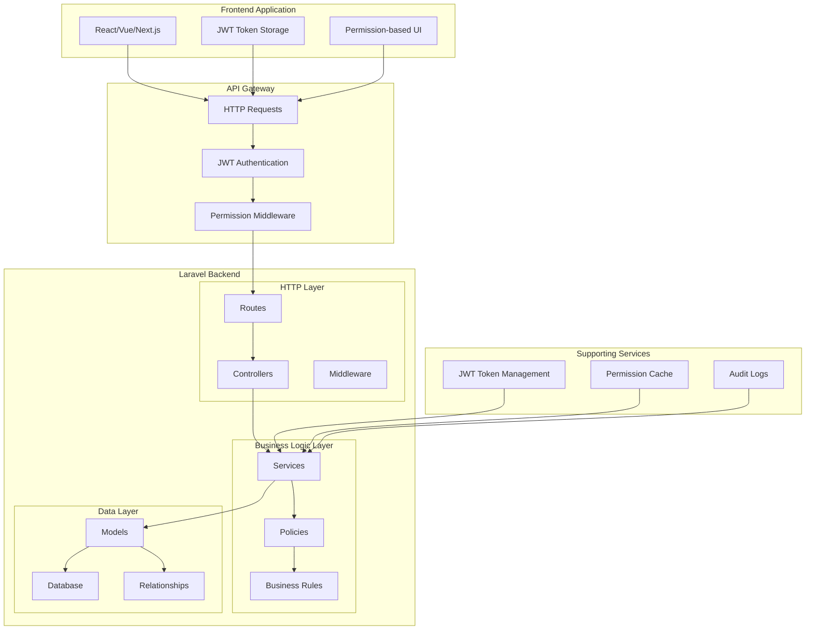
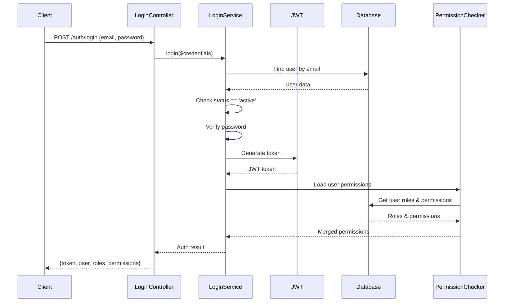
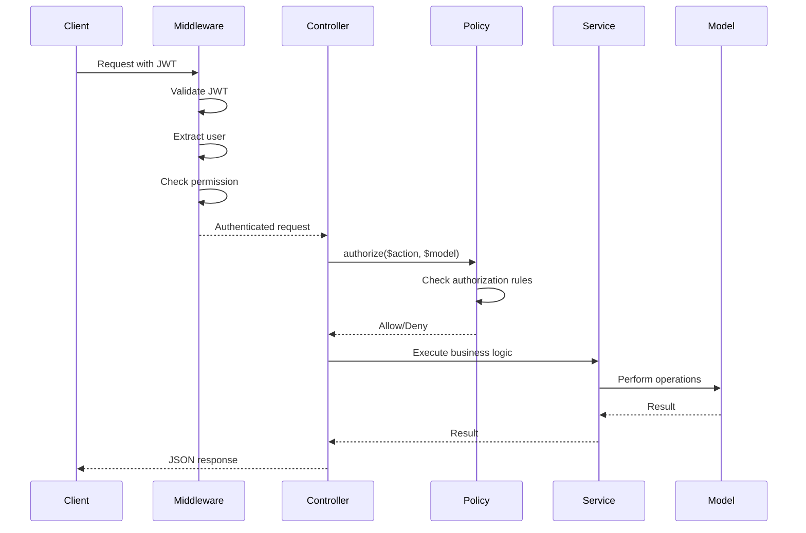
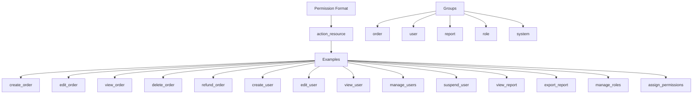
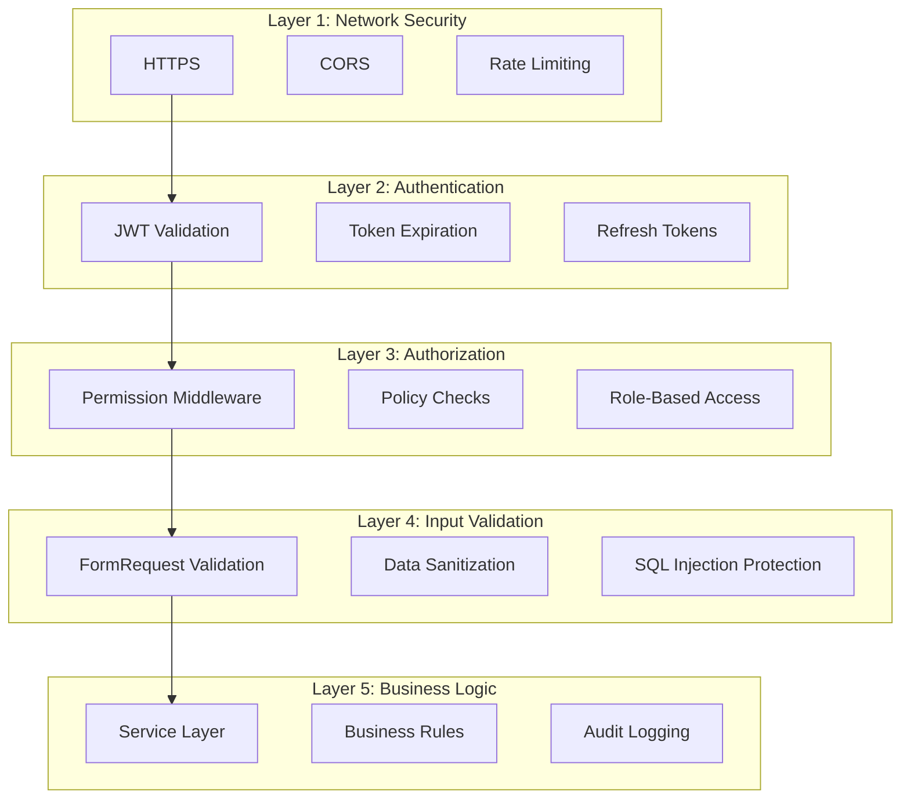

# Laravel API + JWT + RBAC System Architecture

## System Overview



## Folder Structure

```
app/
├── Http/
│   ├── Controllers/
│   │   ├── Auth/
│   │   │   ├── LoginController.php
│   │   │   ├── RefreshTokenController.php
│   │   │   └── ForgotPasswordController.php
│   │   ├── UserController.php
│   │   └── RoleController.php
│   │
│   ├── Middleware/
│   │   ├── JwtAuthenticate.php
│   │   └── CheckPermission.php
│   │
│   ├── Requests/
│   │   ├── Auth/
│   │   │   └── LoginRequest.php
│   │   ├── User/
│   │   │   └── StoreUserRequest.php
│   │   └── Role/
│   │       └── StoreRoleRequest.php
│   │
│   └── Resources/
│       ├── UserResource.php
│       └── RoleResource.php
│
├── Services/
│   ├── Auth/
│   │   ├── LoginService.php
│   │   └── TokenService.php
│   ├── UserService.php
│   └── RoleService.php
│
├── Policies/
│   ├── UserPolicy.php
│   └── RolePolicy.php
│
├── Models/
│   ├── User.php
│   ├── Role.php
│   └── Permission.php
│
└── Support/
    ├── Auth/
    │   └── PermissionChecker.php
    └── Response/
        └── ApiResponse.php
```

## Database Schema

```mermaid
erDiagram
    users ||--o{ role_user : "has"
    users ||--o{ activity_logs : "creates"
    users {
        bigint id PK
        string name
        string email UK
        string password
        enum status
        timestamp last_login_at
        timestamps
    }

    roles ||--o{ role_user : "belongs to"
    roles ||--o{ permission_role : "has"
    roles {
        bigint id PK
        string name UK
        string label
        text description
        timestamps
    }

    permissions ||--o{ permission_role : "belongs to"
    permissions {
        bigint id PK
        string name UK
        string label
        string group
        timestamps
    }

    role_user {
        bigint user_id PK,FK
        bigint role_id PK,FK
        timestamps
    }

    permission_role {
        bigint role_id PK,FK
        bigint permission_id PK,FK
        timestamps
    }

    activity_logs {
        bigint id PK
        bigint user_id FK
        string action
        string target_type
        bigint target_id
        json metadata
        timestamps
    }
```

## Authentication Flow



## Authorization Flow



## API Endpoints Structure

```mermaid
graph LR
    A[Auth Endpoints] --> A1[POST /auth/login]
    A --> A2[POST /auth/refresh]
    A --> A3[POST /auth/logout]
    A --> A4[POST /auth/forgot-password]
    A --> A5[POST /auth/reset-password]

    B[User Endpoints] --> B1[GET /me]
    B --> B2[GET /users]
    B --> B3[POST /users]
    B --> B4[PUT /users/{id}]
    B --> B5[PATCH /users/{id}/status]

    C[Role Endpoints] --> C1[GET /roles]
    C --> C2[POST /roles]
    C --> C3[PUT /roles/{id}]

    D[Permission Endpoints] --> D1[GET /permissions]

    E[Assignment Endpoints] --> E1[POST /users/{id}/roles]
    E --> E2[POST /roles/{id}/permissions]

    A --> F[No Authentication Required]
    B --> G[Authentication Required]
    C --> G
    D --> G
    E --> G
```

## Permission Naming Convention



## Security Layers


